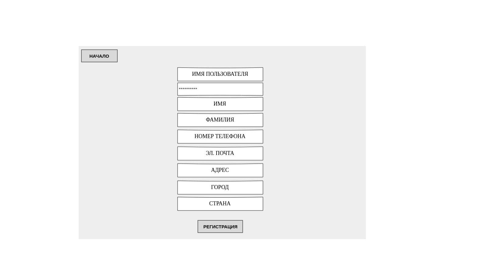

# MUSICTASTE

*Цель работы* - разработка и реализация магазина музыкальных альбомов.

### Функциональные требования

* отображение списка альбомов;
* отображение соответствующих подарков;
* регистрация нового пользователя;
* авторизация пользователя;
* добавление комбинации альбома и подарка в корзину;
* создание заказа;
* изменение данных пользователя;
* удаление пользователя;
* просмотр предыдущих заказов;
* удаление заказа;
* изменение заказа;
* добавление товара;
* изменение товара;
* удаление товара.

### USE-CASE

### BPMN

### Основные пользовательские сценарии
Неавторизованному пользователю разрешено:  
* просматривать каталог и описание товаров;
* зарегистрировать профиль.

Пользователю разрешено:
* просматривать каталог и описание товаров;
* добавить товары в корзину;  
* оформить заказ;  
* просматривать предыдущие заказы;
* изменить и удалить профиль.

Администратору разрешено:
* создать, изменить и удалить товары.

Менеджеру разрешено:
* просматривать все заказы;
* отменить и изменить заказ.

### ER-диаграмма в нотации Чена

### Диаграмма БД

### Верхнеуровневое разбиение на компоненты 

### Экраны будущего web-приложения на уровне черновых эскизов

